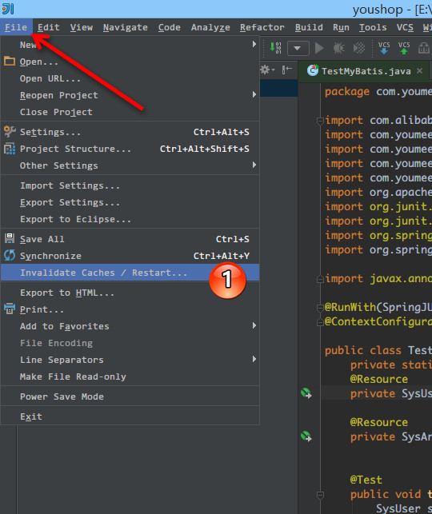
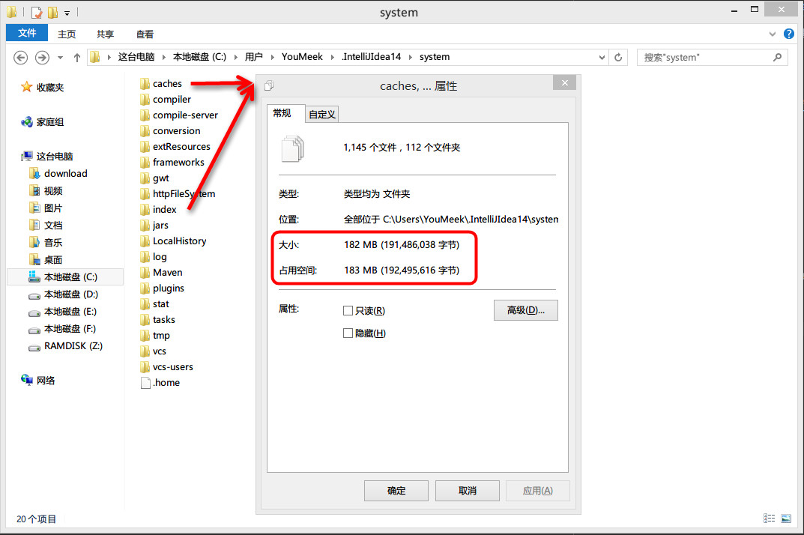

# IntelliJ IDEA 缓存和索引介绍和清理方法

## 缓存和索引介绍 

在第十讲的时候已经点到了 IntelliJ IDEA 首次加载项目的时候，都会创建索引，而创建索引的时间跟项目的文件多少成正比，我也简单强调了 IntelliJ IDEA 索引的重要性。这里我们再对此进行详细说明索引、缓存对 IntelliJ IDEA 的重要性。

通过第十一讲，你已经认识到 IntelliJ IDEA 下各个文件类型的图标是什么样子的。其中有一个图标我是专门进行了讲解： `Java class located out of the source root`。我们也都知道该图标是表示 Java 类文件没有在 `Source root` 目录下的文件夹下会显示此图标，但是其实还有一种情况也是会显示此图标的。那就是：在 IntelliJ IDEA 创建索引过程中，所有的 Java类 都是这个图标，如果你项目大的话很容易观察到的，几个文件的小项目倒是不一定会看到。所以在 IntelliJ IDEA 创建索引过程即使你编辑了代码也是编译不了、运行不起来的，所以还是安安静静等 IntelliJ IDEA 创建索引完成。

IntelliJ IDEA 的缓存和索引主要是用来加快文件查询，从而加快各种查找、代码提示等操作的速度，所以 IntelliJ IDEA 的索引的重要性我再唠叨一万遍都不为过。但是，IntelliJ IDEA 的索引和缓存并不是一直会良好地支持 IntelliJ IDEA 的，这某些特殊条件下，IntelliJ IDEA 的缓存和索引文件也是会损坏的，比如：断电、蓝屏引起的强制关机，当你重新打开 IntelliJ IDEA，基本上百分八十的可能 IntelliJ IDEA 都会报各种莫名其妙错误，甚至项目打不开，IntelliJ IDEA 主题还原成默认状态。也有一些即使没有断电、蓝屏，也会有莫名奇怪的问题的时候，也很有可能是 IntelliJ IDEA 缓存和索引出问题，这种情况还不少。遇到此类问题也不用过多担心。，下面就来讲解如何解决。

## 清除缓存和索引

> * IntelliJ IDEA 已经自带提供清除缓存、索引的路口，如上图标注 1 所示。

> * 一般建议点击 `Invalidate and Restart`，这样会比较干净。
> * 但是有一个需要提醒的是，如上图红圈标注的地方：清除索引和缓存会使得 IntelliJ IDEA 的 `Local History` 丢失，所以如果你项目没有加入到版本控制，而你又需要你项目文件的历史更改记录，那你最好备份下你的 `LocalHistory` 目录。目录地址在：`C:\Users\当前登录的系统用户名\.IntelliJIdea14\system\LocalHistory` 建议使用硬盘的全文搜索，这样效率更高。

通过上面方式清除缓存、索引本质也就是去删除 C 盘下的 `system` 目录下的对应的文件而已，所以如果你不用上述方法也可以删除整个 `system`。当 IntelliJ IDEA 再次启动项目的时候会重新创建新的 `system` 目录以及对应项目缓存和索引。

如果你遇到了因为索引、缓存坏了以至于项目打不开，那也建议你可以直接删除 `system` 目录，一般这样都可以很好地解决你的问题。

## 其他

> * 目前我电脑的 IntelliJ IDEA 是新装的，也就打开了几个小项目，所有打开的项目大小加起来不到 5 M，但是他们创建的索引大家就已经上百兆了，如上图所示。所以如果你 C 盘空间不足的情况下，最好转移下 `system` 目录，方法可以根据第八讲讲解的方法进行。
