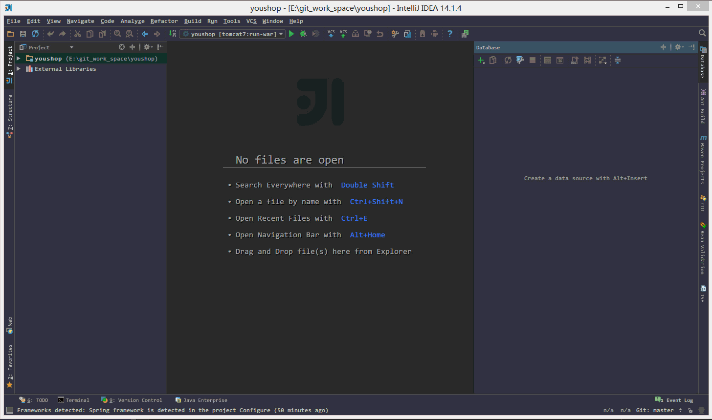
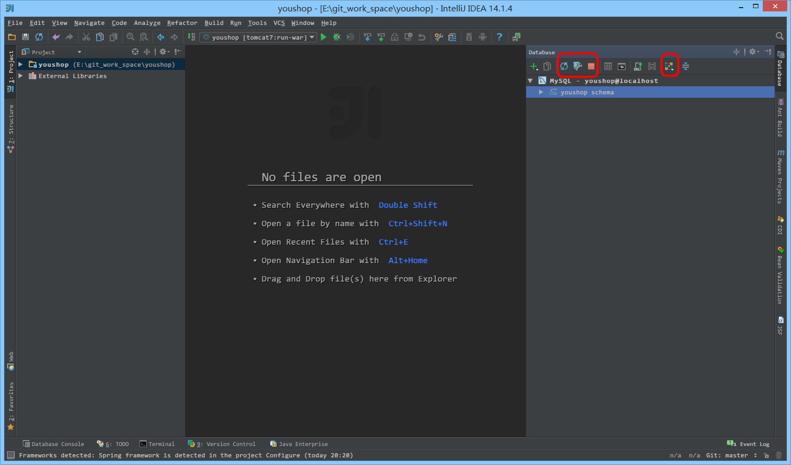

# 数据库管理工具介绍

## 配置 Database 组件的数据库连接

> * 表面上很多人认为配置 Database 就是为了有一个 GUI 管理数据库功能，但是这并不是 IntelliJ IDEA 的 Database 最重要特性。数据库的 GUI 工具有很多，IntelliJ IDEA 的 Database 也没有太明显的优势。IntelliJ IDEA 的　Database 最大特性就是对于 Java Web 项目来讲，常使用的 ORM 框架，如 Hibernate、Mybatis 有很好的支持，比如配置好了 Database 之后，IntelliJ IDEA 会自动识别 domain 对象与数据表的关系，也可以通过 Database 的数据表直接生成 domain 对象等等。 

> * 如上图 Gif 所示，这是一个完成的配置 Database 过程，对于数据库需要的依赖包，IntelliJ IDEA 可以自动帮我们下载，所以我们只要配置对应的连接参数即可。

## Database 设置

> * 如上图标注的红圈所示，这是 Database 常用的四个操作。
>
>> * 第一个按钮是同步当前数据库连接。这个是最重要的操作，有一些情况下，当我们配置好连接之后，没有显示数据表，那就是需要点击该按钮进行同步。还有一种情况就是我们在 IntelliJ IDEA 之外用其他工具操作数据库，比如新建表。而此时 IntelliJ IDEA 的 Database 如果没有同步到新表，也是需要点击此按钮进行同步的。
>> * 第二个按钮是配置当前连接，跟我们首次设置连接的界面是一样的。
>> * 第三个按钮是断点当前的连接。
>> * 第四个按钮是查看当前所选对象的图标结构，比如我们当前选中的是整个数据库名，我们如果点击此按钮，则是显示该数据库下的所有数据表的图标结构图。
