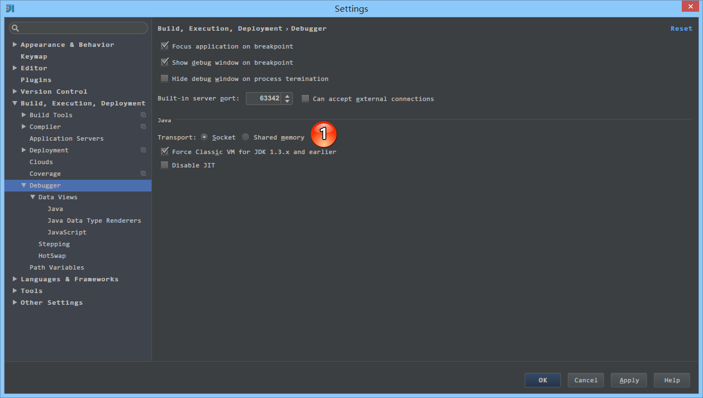
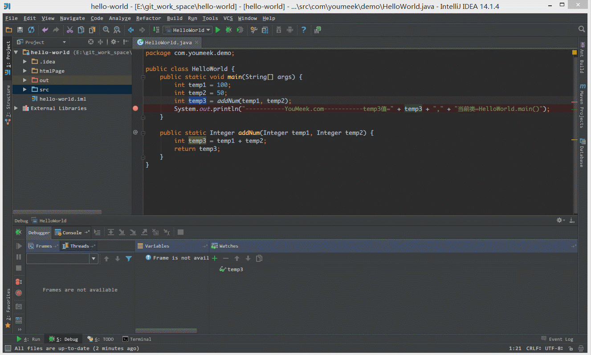
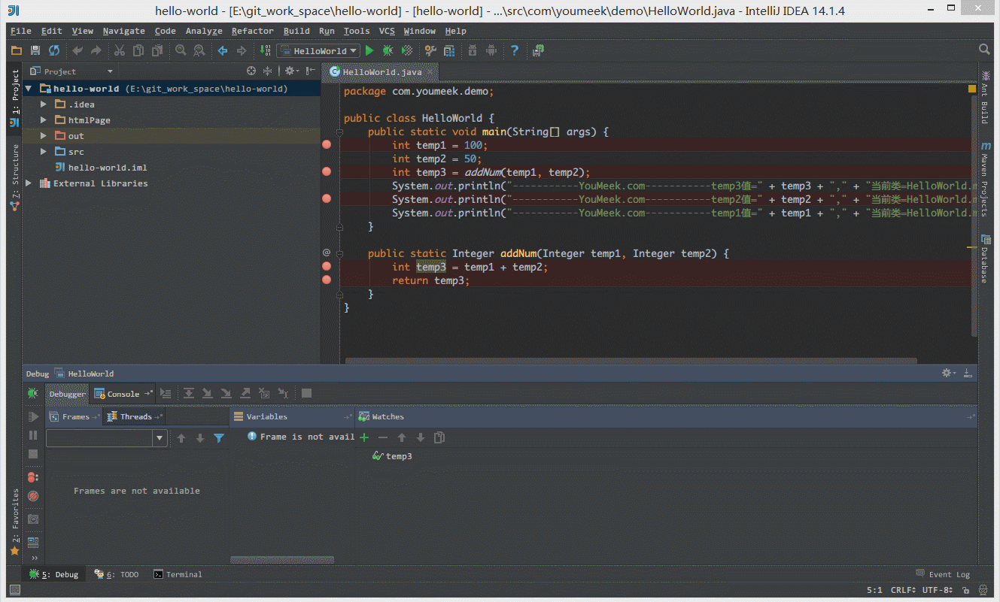

# Debug 介绍

## Debug 设置

> * 如上图标注 1 所示，表示设置 Debug 连接方式，默认是 `Socket`。`Shared memory` 是 Windows 特有的一个属性，一般在 Windows 系统下建议使用此设置，相对于 `Socket` 会快点。

## Debug 常用快捷键

|快捷键|介绍|
|:---------|:---------|
|F7|在 Debug 模式下，进入下一步，如果当前行断点是一个方法，则进入当前方法体内，如果该方法体还有方法，则不会进入该内嵌的方法中 `必备`|
|F8|在 Debug 模式下，进入下一步，如果当前行断点是一个方法，则不进入当前方法体内 `必备`|
|F9|在 Debug 模式下，恢复程序运行，但是如果该断点下面代码还有断点则停在下一个断点上 `必备`|
|Alt + F8|在 Debug 的状态下，选中对象，弹出可输入计算表达式调试框，查看该输入内容的调试结果 `必备`|
|Ctrl + F8|在 Debug 模式下，设置光标当前行为断点，如果当前已经是断点则去掉断点|
|Shift + F7|在 Debug 模式下，智能步入。断点所在行上有多个方法调用，会弹出进入哪个方法|
|Shift + F8|在 Debug 模式下，跳出，表现出来的效果跟 `F9` 一样|
|Ctrl + Shift + F8|在 Debug 模式下，指定断点进入条件|
|Alt + Shift + F7|在 Debug 模式下，进入下一步，如果当前行断点是一个方法，则进入当前方法体内，如果方法体还有方法，则会进入该内嵌的方法中，依此循环进入|

有时候我们可以这样粗鲁地认为 Debug 的使用就是等同于这几个快捷键的使用，所以上面的 `必备` 快捷键是我们必须牢记的，这些也是开发很常用的。 

## Debug 特殊技能使用

> * 如上图 Gif 所示，查看所选对象的方法常用有三种方式：
>> * 选中对象后，使用快捷键 `Alt + F8`。 
>> * 选中对象后，拖动对象到 `Watches`。 
>> * 选中对象后，鼠标悬停在对象上 2 秒左右。 

> * 如上图 Gif 所示，在弹出表达式输入框中 IntelliJ IDEA 也是能帮我们智能提示。

> * 如上图 Gif 所示，当我们需要过掉后面的所有断点的时候，我们不需要去掉这些断点，只需要点击左下角那个小圆点，点击小圆点之后，所有断点变成灰色，然后我们再在按快捷键 `F9` 即可过掉当前和后面所有的断点。

> * 我们可以给断点设置进入的条件。如上图 Gif 所示，因为变量 temp3 不等于 200 所以该断点没有被进入直接跳过。

> * 有时候当我们步入方法体之后，还想回退到方法体外。如 Gif 演示，断点进入 `addNum` 方法后，点击 `Drop Frame` 按钮之后，断点重新回到方法体之外。