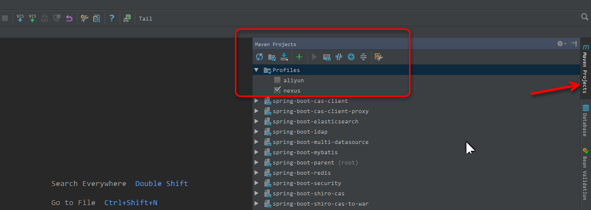

# IntelliJ IDEA 配合 Maven 的一些技巧

## 环境

- IntelliJ IDEA 2017.1
- Maven 3.3.9
- Nexus 3.2.1

## 学习前提

- 了解 Maven 配置的基本用法
- 了解私有仓库，比如 nexus 的一些概念

### Maven 中的 profile

- Maven 中有一个概念叫做：`profile`，它的诞生主要是为了解决不同环境所需的不同变量、配置等问题。
- 有了 profile，可以根据激活的条件，启动不同条件下的配置信息。
- profile 是可以有多个的，也可以同时激活多个 profile，方便只有组合。
- profile 一般可以在三个地方：settings.xml，pom.xml，profiles.xml（这个不常用）
- 在 settings.xml 上，一般大家用来做仓库的选择，比如以下 settings.xml 代码：

``` xml
<?xml version="1.0" encoding="UTF-8"?>

<settings xmlns="http://maven.apache.org/SETTINGS/1.0.0"
          xmlns:xsi="http://www.w3.org/2001/XMLSchema-instance"
          xsi:schemaLocation="http://maven.apache.org/SETTINGS/1.0.0 http://maven.apache.org/xsd/settings-1.0.0.xsd">

    <localRepository>D:\maven\my_local_repository</localRepository>

    <pluginGroups>
    </pluginGroups>

    <proxies>
    </proxies>

    <profiles>
        <profile>
            <id>nexus</id>
            <repositories>
                <repository>
                    <id>nexus</id>
                    <url>http://192.168.1.73:8081/repository/maven-public/</url>
                    <releases>
                        <enabled>true</enabled>
                    </releases>
                    <snapshots>
                        <enabled>true</enabled>
                    </snapshots>
                </repository>
            </repositories>
            <pluginRepositories>
                <pluginRepository>
                    <id>nexus</id>
                    <url>http://192.168.1.73:8081/repository/maven-public/</url>
                    <releases>
                        <enabled>true</enabled>
                    </releases>
                    <snapshots>
                        <enabled>true</enabled>
                    </snapshots>
                </pluginRepository>
            </pluginRepositories>
        </profile>
        <profile>
            <id>aliyun</id>
            <repositories>
                <repository>
                    <id>aliyun</id>
                    <url>http://maven.aliyun.com/nexus/content/groups/public/</url>
                    <releases>
                        <enabled>true</enabled>
                    </releases>
                    <snapshots>
                        <enabled>true</enabled>
                    </snapshots>
                </repository>
            </repositories>
            <pluginRepositories>
                <pluginRepository>
                    <id>aliyun</id>
                    <url>http://maven.aliyun.com/nexus/content/groups/public/</url>
                    <releases>
                        <enabled>true</enabled>
                    </releases>
                    <snapshots>
                        <enabled>true</enabled>
                    </snapshots>
                </pluginRepository>
            </pluginRepositories>
        </profile>
    </profiles>

    <activeProfiles>
        <activeProfile>nexus</activeProfile>
    </activeProfiles>

</settings>
```

- 以上代码中 profile 就做一件事：设置全局的 profile，一个是 nexus 仓库，一个是 aliyun 仓库，默认激活的是 nexus 仓库。（activeProfiles）
- 在 pom.xml 中，一般用来激活环境配置，比如：

``` xml
<profiles>
    <profile>
        <id>dev</id>
        <properties>
            <package.environment>dev</package.environment>
        </properties>
        <activation>
            <activeByDefault>true</activeByDefault>
        </activation>
        <build>
            <resources>
                <resource>
                    <directory>src/main/resources</directory>
                    <includes>
                        <include>**/*</include>
                    </includes>
                    <filtering>true</filtering>
                </resource>
                <resource>
                    <directory>src/main/env/${package.environment}</directory>
                    <includes>
                        <include>**/*</include>
                    </includes>
                    <filtering>true</filtering>
                </resource>
            </resources>
            <finalName>${project.artifactId}</finalName>
        </build>
    </profile>
    <profile>
        <id>product</id>
        <properties>
            <package.environment>product</package.environment>
        </properties>
        <activation>
            <activeByDefault>false</activeByDefault>
        </activation>
        <build>
            <resources>
                <resource>
                    <directory>src/main/resources</directory>
                    <includes>
                        <include>**/*</include>
                    </includes>
                    <filtering>true</filtering>
                </resource>
                <resource>
                    <directory>src/main/env/${package.environment}</directory>
                    <includes>
                        <include>**/*</include>
                    </includes>
                    <filtering>true</filtering>
                </resource>
            </resources>
            <finalName>${project.artifactId}</finalName>
        </build>
    </profile>
</profiles>
```

- 以上代码中 profile 就做一件事：打包的时候，默认是 dev 模式，打包 src/main/env/dev 下的配置文件，如果选择 product 则打包 src/main/env/product 下的配置文件

### IntelliJ IDEA 使用 Maven Profile 的案例

- 在 IntelliJ IDEA 上调用 profile 简单，如下图勾选对应的复选框即可，可以多选。



- 只使用 aliyun 仓库可以这样配置 settings.xml：

``` xml
<?xml version="1.0" encoding="UTF-8"?>

<settings xmlns="http://maven.apache.org/SETTINGS/1.0.0"
          xmlns:xsi="http://www.w3.org/2001/XMLSchema-instance"
          xsi:schemaLocation="http://maven.apache.org/SETTINGS/1.0.0 http://maven.apache.org/xsd/settings-1.0.0.xsd">

    <localRepository>D:\maven\my_local_repository</localRepository>

    <pluginGroups>
    </pluginGroups>

    <proxies>
    </proxies>

    <profiles>
        <profile>
            <id>aliyun</id>
            <repositories>
                <repository>
                    <id>aliyun</id>
                    <url>http://maven.aliyun.com/nexus/content/groups/public/</url>
                    <releases>
                        <enabled>true</enabled>
                    </releases>
                    <snapshots>
                        <enabled>true</enabled>
                    </snapshots>
                </repository>
            </repositories>
            <pluginRepositories>
                <pluginRepository>
                    <id>aliyun</id>
                    <url>http://maven.aliyun.com/nexus/content/groups/public/</url>
                    <releases>
                        <enabled>true</enabled>
                    </releases>
                    <snapshots>
                        <enabled>true</enabled>
                    </snapshots>
                </pluginRepository>
            </pluginRepositories>
        </profile>
    </profiles>

    <activeProfiles>
        <activeProfile>aliyun</activeProfile>
    </activeProfiles>

</settings>
```

- 使用 nexus + aliyun 仓库可以这样配置 settings.xml：

``` xml
<?xml version="1.0" encoding="UTF-8"?>

<settings xmlns="http://maven.apache.org/SETTINGS/1.0.0"
          xmlns:xsi="http://www.w3.org/2001/XMLSchema-instance"
          xsi:schemaLocation="http://maven.apache.org/SETTINGS/1.0.0 http://maven.apache.org/xsd/settings-1.0.0.xsd">

    <localRepository>D:\maven\my_local_repository</localRepository>

    <pluginGroups>
    </pluginGroups>

    <proxies>
    </proxies>

    <profiles>
        <profile>
            <id>nexus</id>
            <repositories>
                <repository>
                    <id>nexus</id>
                    <url>http://192.168.1.73:8081/repository/maven-public/</url>
                    <releases>
                        <enabled>true</enabled>
                    </releases>
                    <snapshots>
                        <enabled>true</enabled>
                    </snapshots>
                </repository>
            </repositories>
            <pluginRepositories>
                <pluginRepository>
                    <id>nexus</id>
                    <url>http://192.168.1.73:8081/repository/maven-public/</url>
                    <releases>
                        <enabled>true</enabled>
                    </releases>
                    <snapshots>
                        <enabled>true</enabled>
                    </snapshots>
                </pluginRepository>
            </pluginRepositories>
        </profile>
        <profile>
            <id>aliyun</id>
            <repositories>
                <repository>
                    <id>aliyun</id>
                    <url>http://maven.aliyun.com/nexus/content/groups/public/</url>
                    <releases>
                        <enabled>true</enabled>
                    </releases>
                    <snapshots>
                        <enabled>true</enabled>
                    </snapshots>
                </repository>
            </repositories>
            <pluginRepositories>
                <pluginRepository>
                    <id>aliyun</id>
                    <url>http://maven.aliyun.com/nexus/content/groups/public/</url>
                    <releases>
                        <enabled>true</enabled>
                    </releases>
                    <snapshots>
                        <enabled>true</enabled>
                    </snapshots>
                </pluginRepository>
            </pluginRepositories>
        </profile>
    </profiles>

    <activeProfiles>
        <activeProfile>nexus</activeProfile>
    </activeProfiles>

</settings>
```


