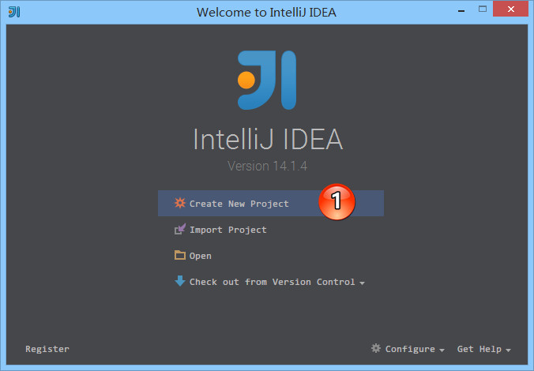
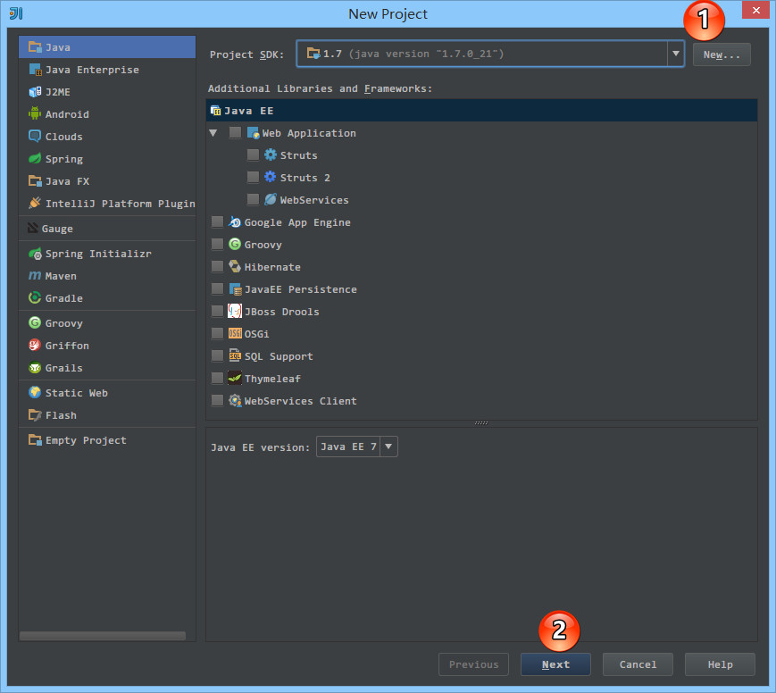
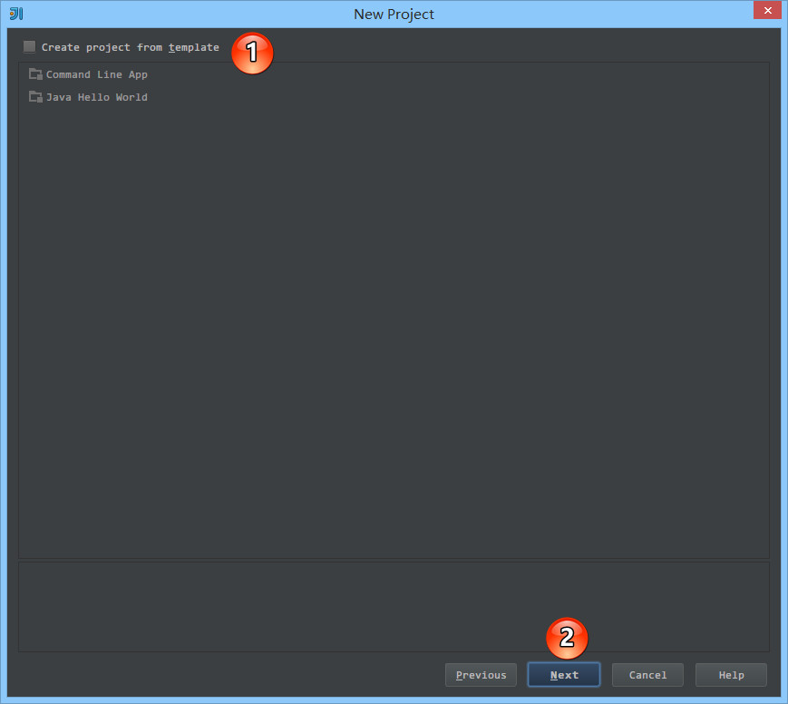
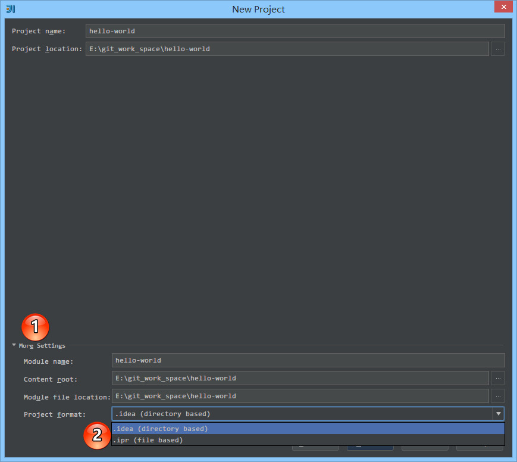
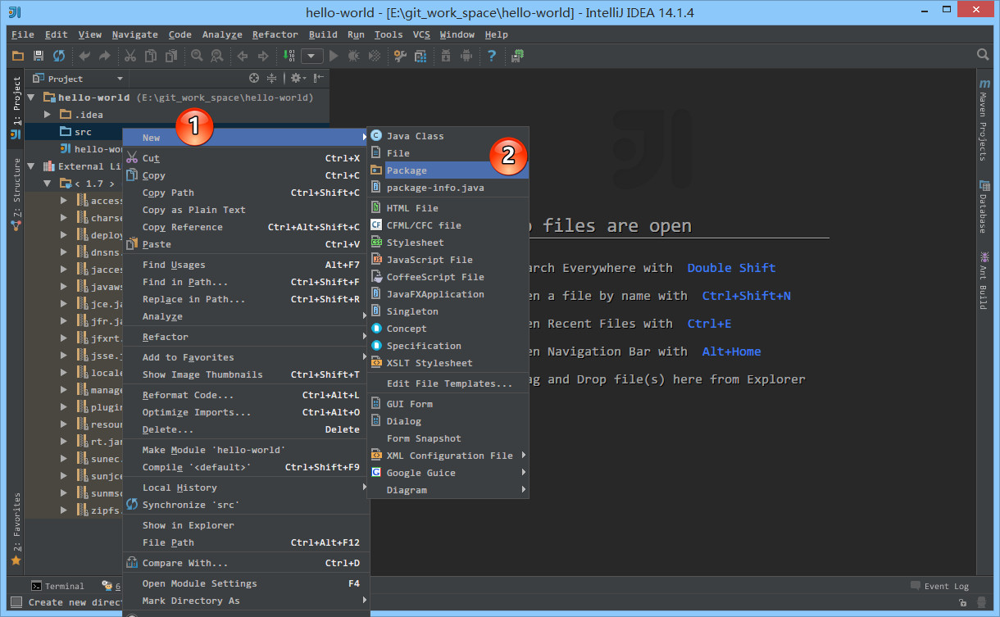
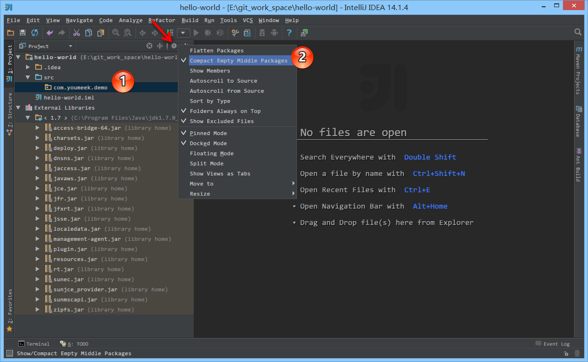
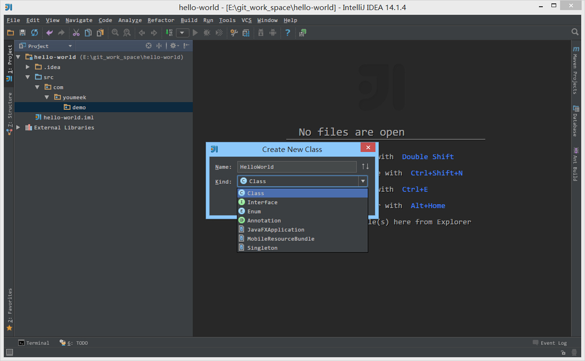
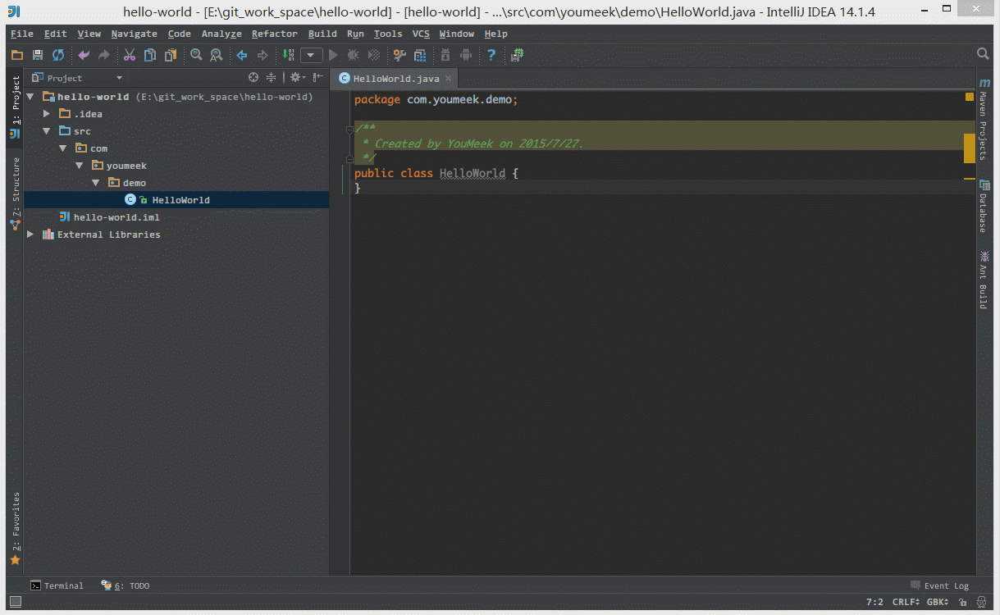
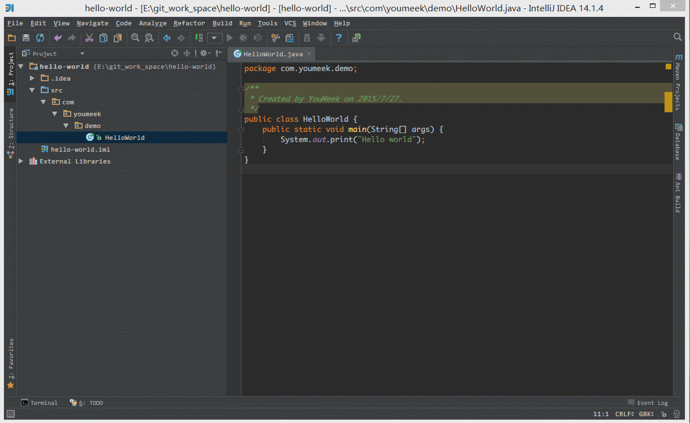
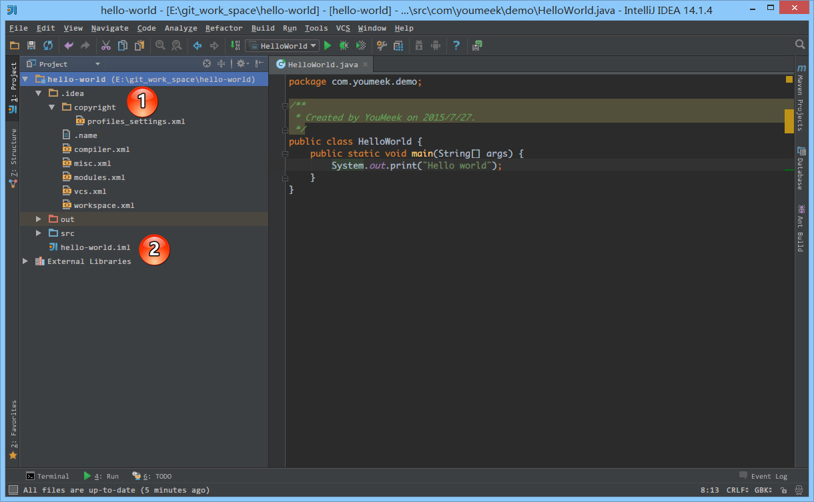

# Hello World 项目创建与项目配置文件介绍

## Hello World 项目创建

> * 如上图标注 1 所示，点击 `Create New Project` 进入向导式创建项目

> * 如上图标注 1 所示，如果此时 IntelliJ IDEA 还没有配置任何一个 SDK 的话，可以点击 `New...` 先进行 SDK 的配置。
> * 如上图标注 2 所示，配置好 SDK 或选择好 SDK 之后，点击 `Next` 进入下一步。

> * 如上图标注 1 所示，可以选择模板快速创建项目。
>
>> * `Command Line App` 会自动创建一个带有 main 方法的类。
>> * `Java Hello World` 会自动创建一个带有 main 方法的并且会打印输出 Hello World 的类。
> * 我们这里不勾选使用模板，而是手工创建，所以我们点击上图标注 2，进入下一步。

> * 如上图标注 1 所示，默认 `More Settings` 是没有展开的，点击此处可以展开更多细节的信息。
> * 如上图标注 2 所示，IntelliJ IDEA 的项目格式文件主要提供两种方式
>
>> * `.idea (directory based)` 创建项目的时候自动创建一个 `.idea` 的项目配置目录来保存项目的配置信息。这是默认选项。
>> * `.ipr (file based)` 创建项目的时候自动创建一个 `.ipr` 的项目配置文件来保存项目的配置信息。
> * 需要特别注意的是，我这边默认创建的项目编码是 GBK，而如果你需要 UTF-8 的话，修改编码的方式请看第 10 讲。

> * 如上图标注 1 所示，根据第 11 讲我们知道，`src` 目录为蓝色表示 `Source root`，我们可以再此目录下创建包和类。
> * 如上图标注 2 所示，由于该项目使用的是 JDK 7，所以项目是基于 JDK 7，我们可以调用 JDK 7 中的类。

> * 如上图标注 1，2 所示，在 `src` 目录右键，选择 `New` 创建包目录。

> * 如上图标注 1 所示，在没有文件的情况下包目录默认是连在一起的，这不方便看目录层级关系。
> * 如上图标注 箭头 所示，点击此齿轮，在弹出的菜单中去掉选择标注 2 选项：`Compact Empty Middle Packages`。

> * 如上图所示，在包下可以直接创建 `Class`、`Interface`、`Enum`、`Annotation` 等常见类型文件。

> * 如上图 Gif 演示，写一个 main 方法，打印输出 Hello world。

> * 如上图 Gif 演示，运行 main 方法，打印输出 Hello world。

## 项目配置文件介绍

> * 如上图标注 1 所示，`.idea` 即为 `Project` 的配置文件目录。
> * 如上图标注 2 所示，`.iml` 即为 `Module` 的配置文件目录。
> * 通过上面的了解我们也知道 IntelliJ IDEA 项目的配置变动都是以这些 XML 文件的方式来表现的，所以我们也可以通过了解这些 XML 文件来了解 IntelliJ IDEA 的一些配置。也因为此特性，所以如果在项目协同中，我们要保证所有的项目配置一致，就可以考虑把这些配置文件上传到版本控制中。如果把这些文件加入到版本控制之后，那又有一点是需要考虑的，那就是协同者 Checkout 项目下来之后，按自己的需求进行项目配置的之后，项目的 XML 文件也会跟着变化。此时协同者的这些变化的文件就不应该再上传到版本控制中。至于如何更好地控制这些不想随时提交的文件，在接下来的版本控制专讲中会进行详细讲解。

## 特别介绍

> * IntelliJ IDEA 是一个没有 `Ctrl + S` 的 IDE，所以每次修改完代码你只要管着运行或者调试即可，无需担心保存或者丢失代码。
> * 现在，放心、大胆地开始你的 Hello World。

